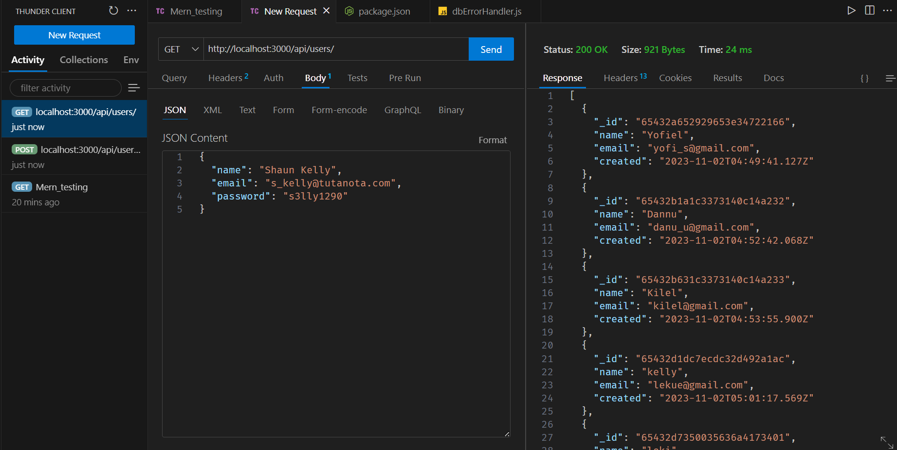
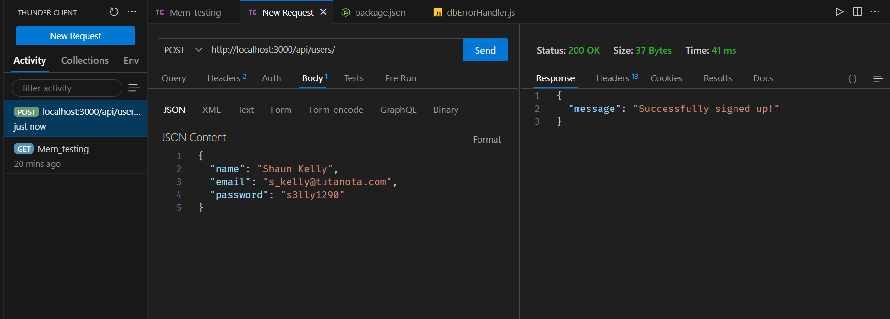
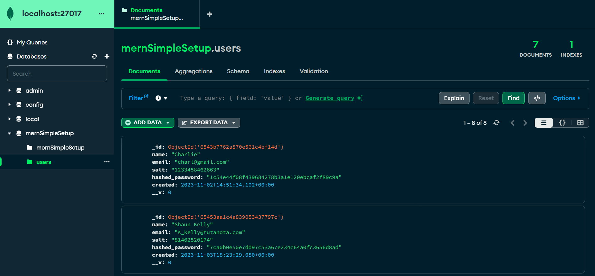
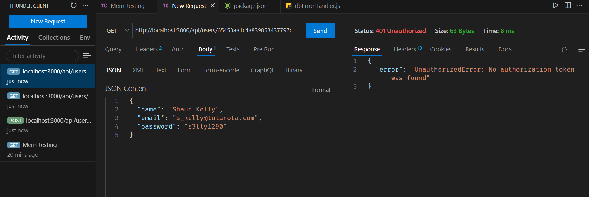
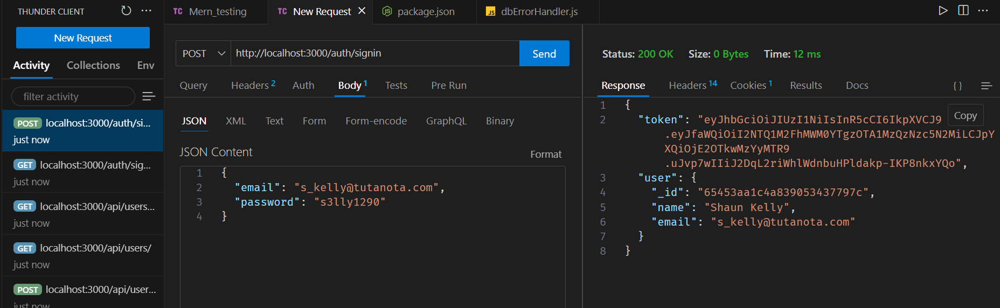
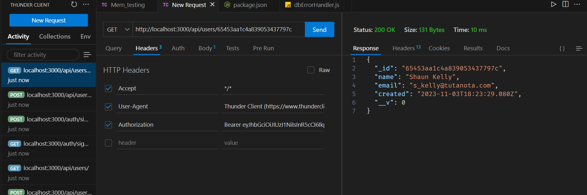

# MERN Backend

A backend application with basic user CRUD and auth features - developed using React, Node, Express and MongoDB.


### What you need to run this code
1. Node (13.12.0)
2. NPM (6.14.4) or Yarn (1.22.4)
3. MongoDB (4.2.0)

### API Testing Screenshots
##### GET REQUEST: List Users



##### POST REQUEST: Post new User


#### POST RESPONSE: New User in MongoDB



#### GET RESPONSE: Get User without Authorization



#### GET RESPONSE: Get Single User without Authorization Token



#### GET RESPONSE: Successful User Signin



###  How to run this code
1. Make sure MongoDB is running on your system
2. Clone this repository
3. Open command line in the cloned folder,
   - To install dependencies, run ```  npm install  ``` or ``` yarn ```
   - To run the application for development, run ```  npm run development  ``` or ``` yarn development ```
4. Open [localhost:3000](http://localhost:3000/) in the browser
----
